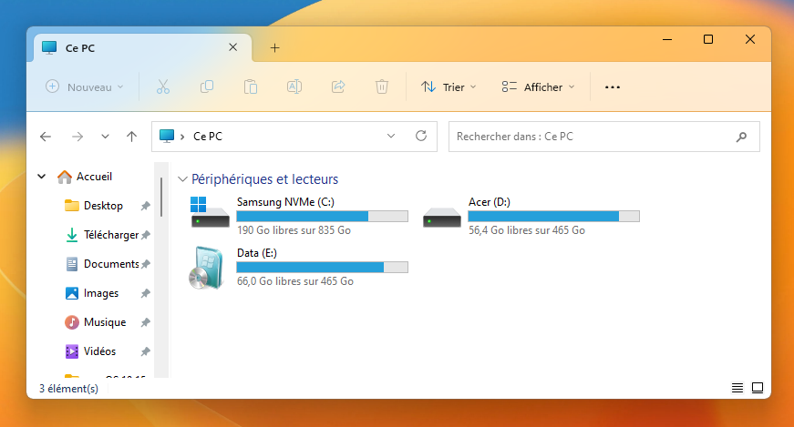
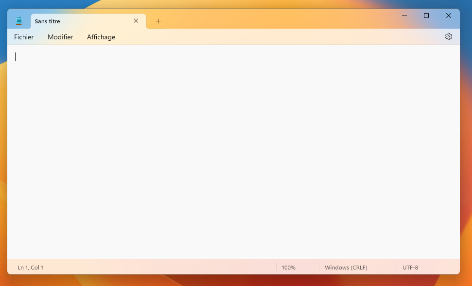
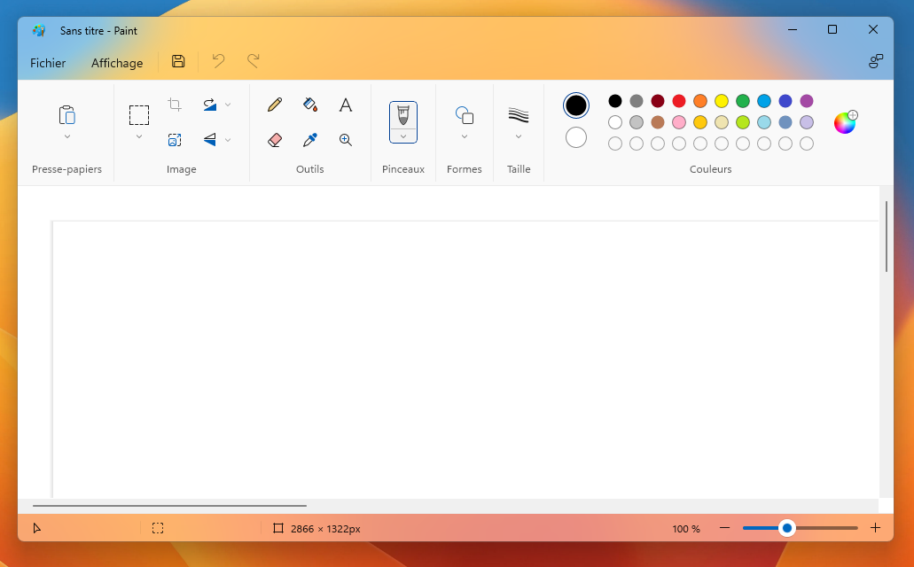

<h1 align=center>Mica Debugging App</h1>
<div align=center>

<b>Mica Debugging App</b> is a tool to add mica effect on any windows application.<br>
This is created by <a href="https://www.youtube.com/gregvido">GregVido</a>.<br>
</div>

<details>
  <summary>Exemple of effects</summary>
  <div align=center>
	
	
  </div> 
</details><br> 

## Usage

Run app.exe in bin folder with a terminal.

```sh
app.exe <processname> <effect>
```
- \<processname\> : process name (ex: Notepad, explorer)
- \<effect\> : effect name
  - mica : applies the mica effect
  - tabbed_mica : applies the tabbed mica effect
  - acrylic : apply an acrylic effect
  - none : deactivate the effect

## Examples of commands

```sh
app.exe Notepad acrylic
```
```sh
app.exe explorer acrylic
```
```sh
app.exe paint acrylic
```